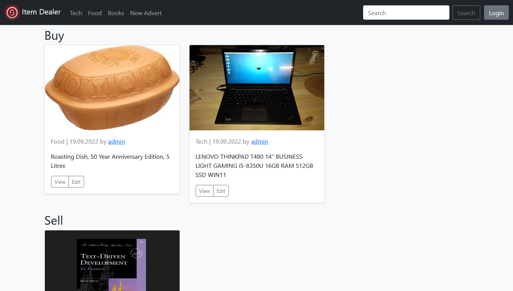

# Item Dealer

<p align="center">
  
</p>

## A website for buying and selling gorgeous items

Feel free to use it as a working template for your ideas.

The logo was created by [DALL-E](https://openai.com/blog/dall-e/), the artificial intelligence.


<p align="center">
  
</p>


## Quick Start

Once you have cloned the repository, be sure to edit the `application.properties` file with the name of the database schema you want to use.

The backend uses a mysql database. Instead of installing depency on your machine, consider using a sacrificial environment for the sake of the cause.
If you want to run mysql in a docker container, here is an example:

```
docker run -it --rm -d -v mysql_data:/var/lib/mysql -v mysql_config:/etc/mysql/conf.d --network mysqlnet --name mysqlserver -e MYSQL_USER=<username> -e MYSQL_PASSWORD=<password> -e MYSQL_ROOT_PASSWORD=<root password> -e MYSQL_DATABASE=<schema> -p 3306:3306 mysql:<version>
```

## Feedback

If something is not working, [create an issue](https://github.com/tturturiello/item-dealer/issues/new).
